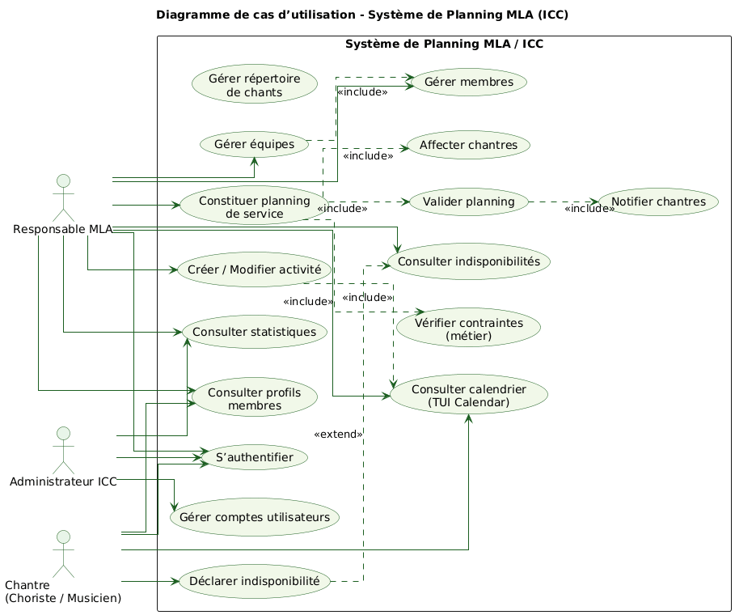
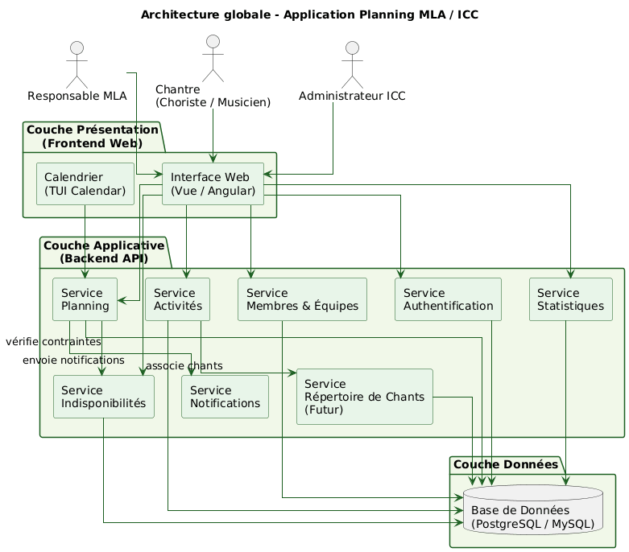
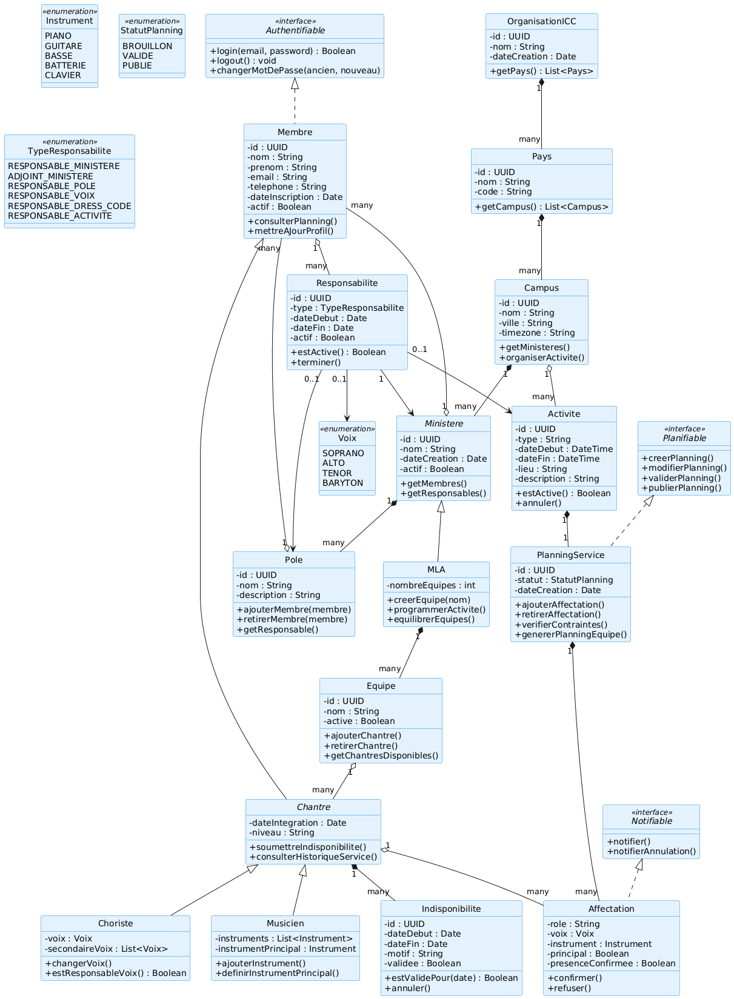
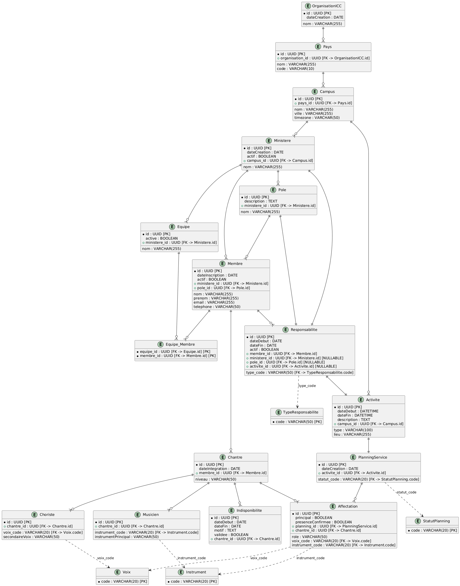
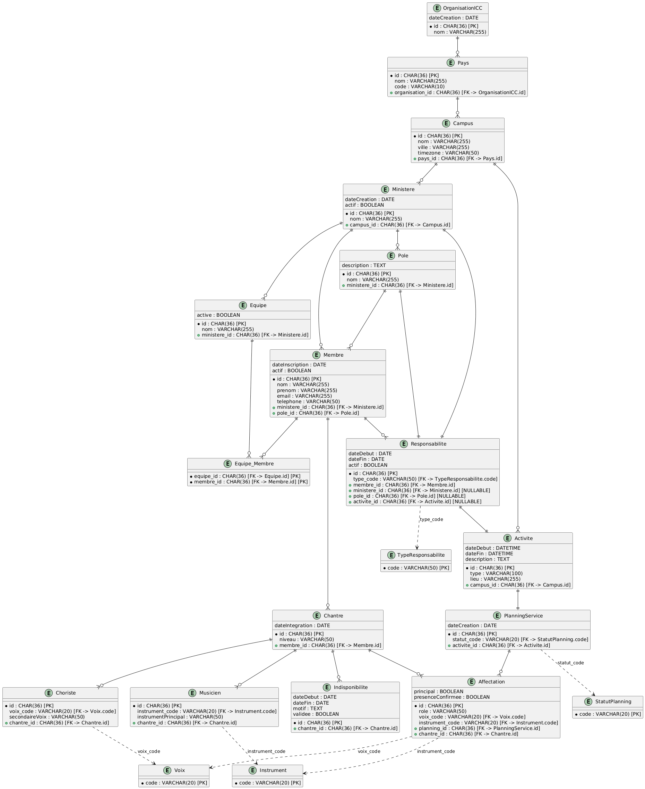
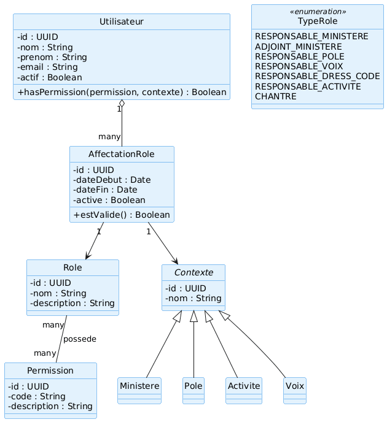

# Conception — MLA Planner

Ce dossier regroupe les artefacts de **conception logicielle** réalisés en amont du développement : cas d'utilisation, architecture globale, diagrammes de classes, modèle entité-relation et modèle logique de données, ainsi que la conception du RBAC.

Il s'adresse aux évaluateurs techniques qui veulent voir la démarche d'analyse et de modélisation avant d'aller lire le code — et vérifier que l'implémentation (voir [`../ARCHITECTURE.md`](../ARCHITECTURE.md)) est restée fidèle au modèle conçu en amont.

Les schémas sont écrits en [PlantUML](https://plantuml.com/) (`.puml`, sources versionnées) et exportés en `.png` pour une lecture directe sans outil.

---

## 1. Cas d'utilisation

| | |
|---|---|
| Source | [`UseCase/usecase1.puml`](UseCase/usecase1.puml) |
| Export | [`UseCase/usecase.png`](UseCase/usecase.png) |

3 acteurs (Responsable MLA, Chantre, Administrateur ICC) et 16 cas d'utilisation couvrant l'authentification, la gestion des activités et du planning, l'affectation des chantres avec vérification des contraintes métier, la gestion des membres/équipes/indisponibilités et le répertoire de chants.

---

## 2. Architecture globale

| | |
|---|---|
| Source | [`ArchitectureGlobale/arch_global.puml`](ArchitectureGlobale/arch_global.puml) |
| Export | [`ArchitectureGlobale/architecture_globale.png`](ArchitectureGlobale/architecture_globale.png) |

Vue en couches (Présentation / Applicative / Données) posée avant le développement. On y retrouve les services Authentification, Membres & Équipes, Activités et Planning qui deviendront les modules `services/` du backend FastAPI — voir la correspondance dans [`../ARCHITECTURE.md`](../ARCHITECTURE.md#backend).

---

## 3. Diagramme de classes

| | |
|---|---|
| Source (v1) | [`DiagrammeDeClasse/class.puml`](DiagrammeDeClasse/class.puml) |
| Source (v2, avec RBAC) | [`DiagrammeDeClasse/class+rbac.puml`](DiagrammeDeClasse/class+rbac.puml) |
| Export | [`DiagrammeDeClasse/diagramme_classes.png`](DiagrammeDeClasse/diagramme_classes.png) |

Modélisation du domaine (interfaces `Authentifiable`, `Planifiable`, `Notifiable`, entités métier Membre/Choriste/Musicien...). La deuxième version (`class+rbac.puml`) fait évoluer le modèle pour intégrer `Utilisateur`, `Role`, `Permission` et `AffectationRole` — première itération vers le RBAC finalement implémenté (voir section 6).

---

## 4. Modèle entité-relation (ERD)

| | |
|---|---|
| Source (v1) | [`ERD/erd.puml`](ERD/erd.puml) |
| Source (v2, généré depuis le code) | [`ERD/erd_v2.puml`](ERD/erd_v2.puml) |
| Export | [`ERD/erd.png`](ERD/erd.png) |

La v1 pose le modèle relationnel initial (référentiels, plannings, affectations). La v2 (`erd_v2.puml`, 41 entités) a été **régénérée depuis `backend/src/models/schema_db_model.py`** — elle documente donc le schéma réellement en base, pas seulement l'intention de départ.

---

## 5. Modèle logique de données (MLD)

| | |
|---|---|
| Sources (itérations) | [`mld.puml`](MDL/mld.puml) → [`mld2.puml`](MDL/mld2.puml) → [`mld3.puml`](MDL/mld3.puml) → [`mld4.puml`](MDL/mld4.puml) → [`mld_v2.puml`](MDL/mld_v2.puml) |
| DDL de référence | [`MDL/table.sql`](MDL/table.sql) |
| Export | [`MDL/mld.png`](MDL/mld.png) |

Cinq itérations successives du MLD, qui tracent la montée en complexité du modèle : ajout du multi-campus / multi-ministère (`mld2`), robustesse des clés (`mld3`, passage à UUID), spécification complète des tables de liaison N:N (`mld4`), puis `mld_v2.puml` régénéré depuis le code (41 tables, colonnes typées SQL avec PK/FK/NOT NULL) — pendant logique de `erd_v2.puml`.

---

## 6. RBAC (contrôle d'accès par rôles)

| | |
|---|---|
| Source | [`RBAC/rbac.uml`](RBAC/rbac.uml) |
| Export | [`RBAC/rbac.png`](RBAC/rbac.png) |

Modélise `Utilisateur` / `Role` / `Permission` / `AffectationRole`, avec un `Contexte` abstrait spécialisé en `Ministere`, `Pole`, `Activite`, `Voix` — permettant une affectation de rôle **scopée** (ex : responsable d'un ministère précis, pas de toute l'organisation). C'est la base conceptuelle du moteur RBAC/Casbin implémenté côté backend, voir [`../ARCHITECTURE.md`](../ARCHITECTURE.md#casbin--moteur-rbac-with-domains).

---

## Visualiser les fichiers `.puml`

Les sources sont au format texte PlantUML. Pour les régénérer ou les modifier :

- **VS Code** : extension [PlantUML](https://marketplace.visualstudio.com/items?itemName=jebbs.plantuml) (`Alt+D` pour prévisualiser)
- **En ligne** : coller le contenu sur [www.plantuml.com/plantuml](https://www.plantuml.com/plantuml/uml/)
- **CLI** : `plantuml *.puml` (nécessite Java + [plantuml.jar](https://plantuml.com/download))
